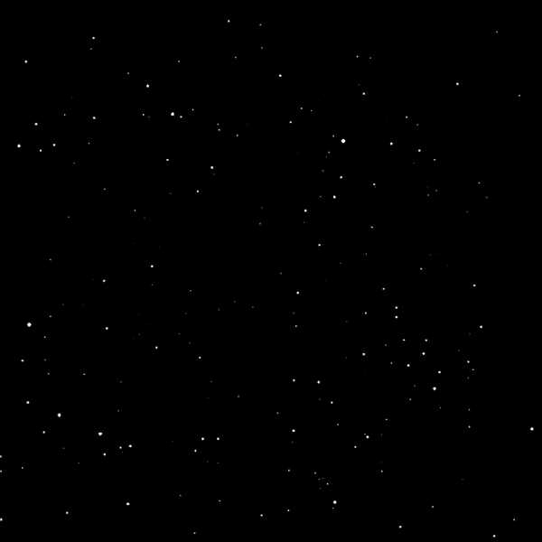

# WarpSpeedEffect

Wizualizacja przelatujących gwiazd (warp speed effect from Star Wars) wykonanane z wykorzystaniem środowiska programistycznego Processing w trybie PythonMode

## Autor
- [Adam Kubiak](https://github.com/AdamKubiak)

### Prezentacja programu

